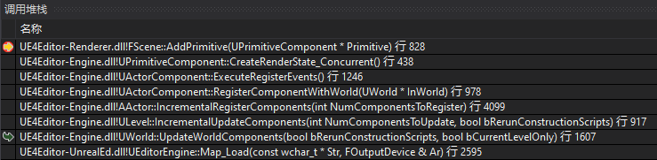

UWorld加载后，调用IncrementalUpdateComponents一次性更新所有的components


每个PrimitiveComponent添加到场景中后，在CreateRenderState_Concurrent阶段根据条件被添加到Scene的Primitives中

```cpp
void UPrimitiveComponent::CreateRenderState_Concurrent()
{
	...
	// If the primitive isn't hidden and the detail mode setting allows it, add it to the scene.
	if (ShouldComponentAddToScene())
	{
		GetWorld()->Scene->AddPrimitive(this);
	}
	...
}
```

在Scene->AddPrimitive中，利用FPrimitiveSceneInfo封装UPrimitiveComponent的信息，继续在render线程中进行操作
```cpp
// Send a command to the rendering thread to add the primitive to the scene.
FScene* Scene = this;
ENQUEUE_RENDER_COMMAND(AddPrimitiveCommand)(
	[Scene, PrimitiveSceneInfo](FRHICommandListImmediate& RHICmdList)
	{
		FScopeCycleCounter Context(PrimitiveSceneInfo->Proxy->GetStatId());
		Scene->AddPrimitiveSceneInfo_RenderThread(RHICmdList, PrimitiveSceneInfo);
	});
```

AddPrimitiveSceneInfo_RenderThread中，完成PrimitiveBounds、PrimitiveFlagsCompact等数据的初始化后，并调用LinkAttachmentGroup处理primitive的父子关系，调用LinkLODParentComponent处理LOD父子关系，然后调用FPrimitiveSceneInfo::AddToScene
```cpp
// Add the primitive to its shadow parent's linked list of children.
	// Note: must happen before AddToScene because AddToScene depends on LightingAttachmentRoot
PrimitiveSceneInfo->LinkAttachmentGroup();

// Set lod Parent information if valid
PrimitiveSceneInfo->LinkLODParentComponent();

// Add the primitive to the scene.
const bool bAddToDrawLists = !(CVarDoLazyStaticMeshUpdate.GetValueOnRenderThread() && !WITH_EDITOR);
if (bAddToDrawLists)
{
	PrimitiveSceneInfo->AddToScene(RHICmdList, true);
}
else
{
	PrimitiveSceneInfo->AddToScene(RHICmdList, true, false);
	PrimitiveSceneInfo->BeginDeferredUpdateStaticMeshes();
}
```

AddToScene中，先处理静态光照，如果没有built lighting，则需要申请间接光照cache用于预览间接光照，然后通过调用对应Component的SceneProxy的DrawStaticElements，DrawStaticElements中调用GetMeshElement将相关数据封装进FMeshBatch，然后调用FStaticPrimitiveDrawInterface::DrawMesh
```cpp
for (int32 BatchIndex = 0; BatchIndex < NumBatches; BatchIndex++)
{
	FMeshBatch MeshBatch;

	if (GetMeshElement(LODIndex, BatchIndex, SectionIndex, PrimitiveDPG, bUseSelectedMaterial, bUseHoveredMaterial, true, MeshBatch))
	{
		PDI->DrawMesh(MeshBatch, FLT_MAX);
	}
}
```
在FPrimitiveSceneInfo::StaticMeshes中申请空间，放入FStaticMesh，FStaticMesh继承自FMeshBatch，就是把FMeshBatch的数据又封装了一层，包含了FPrimitiveSceneInfo等信息
```cpp
virtual void DrawMesh(const FMeshBatch& Mesh, float ScreenSize) final override
{
	if (Mesh.GetNumPrimitives() > 0)
	{
		check(Mesh.VertexFactory);
		check(Mesh.VertexFactory->IsInitialized());
#if DO_CHECK
		Mesh.CheckUniformBuffers();
#endif
		PrimitiveSceneInfo->Proxy->VerifyUsedMaterial(Mesh.MaterialRenderProxy);

		FStaticMesh* StaticMesh = new(PrimitiveSceneInfo->StaticMeshes) FStaticMesh(
			PrimitiveSceneInfo,
			Mesh,
			ScreenSize,
			CurrentHitProxy ? CurrentHitProxy->Id : FHitProxyId()
		);
	}
}
```

接着回到AddStaticMeshes，遍历刚刚添加到FPrimitiveSceneInfo::StaticMeshes中的StaticMesh，调用AddToDrawLists，利用DrawingPolicyFactory将StaticMesh添加到FScene的的各种DrawList中
```cpp
void FStaticMesh::AddToDrawLists(FRHICommandListImmediate& RHICmdList, FScene* Scene)
{
	...
	// Add the static mesh to the DPG's hit proxy draw list.
	FHitProxyDrawingPolicyFactory::AddStaticMesh(Scene, this);
	...
	FShadowDepthDrawingPolicyFactory::AddStaticMesh(Scene, this);
	...
	FDepthDrawingPolicyFactory::AddStaticMesh(Scene,this);
	...
	FVelocityDrawingPolicyFactory::AddStaticMesh(Scene, this);
	...
	FMobileBasePassOpaqueDrawingPolicyFactory::AddStaticMesh(RHICmdList, Scene, this);
	...
}
```

FScene中的各种DrawList
```cpp
	...
	/** hit proxy draw list (includes both opaque and translucent objects) */
	TStaticMeshDrawList<FHitProxyDrawingPolicy> HitProxyDrawList;

	/** hit proxy draw list, with only opaque objects */
	TStaticMeshDrawList<FHitProxyDrawingPolicy> HitProxyDrawList_OpaqueOnly;

	/** draw list for motion blur velocities */
	TStaticMeshDrawList<FVelocityDrawingPolicy> VelocityDrawList;

	/** Draw list used for rendering whole scene shadow depths. */
	TStaticMeshDrawList<FShadowDepthDrawingPolicy<false> > WholeSceneShadowDepthDrawList;

	/** Draw list used for rendering whole scene reflective shadow maps.  */
	TStaticMeshDrawList<FShadowDepthDrawingPolicy<true> > WholeSceneReflectiveShadowMapDrawList;
	...
```

以FBasePassOpaqueDrawingPolicyFactory为例，在FBasePassOpaqueDrawingPolicyFactory中，只绘制不透明材质
```cpp
void FBasePassOpaqueDrawingPolicyFactory::AddStaticMesh(FRHICommandList& RHICmdList, FScene* Scene, FStaticMesh* StaticMesh)
{
	// Determine the mesh's material and blend mode.
	const FMaterial* Material = StaticMesh->MaterialRenderProxy->GetMaterial(Scene->GetFeatureLevel());
	const EBlendMode BlendMode = Material->GetBlendMode();

	// Only draw opaque materials.
	if (!IsTranslucentBlendMode(BlendMode) && ShouldIncludeDomainInMeshPass(Material->GetMaterialDomain()))
	{
		ProcessBasePassMesh(
			RHICmdList, 
			FProcessBasePassMeshParameters(
				*StaticMesh,
				Material,
				StaticMesh->PrimitiveSceneInfo->Proxy,
				false,
				ESceneRenderTargetsMode::DontSet,
				Scene->GetFeatureLevel()),
			FDrawBasePassStaticMeshAction(Scene,StaticMesh)
			);
	}
}
```

ProcessBasePassMesh中，调用传入的FDrawBasePassStaticMeshAction的Process函数，根据不同的LightMapPolicyType进行处理，将Mesh添加到List中
```cpp
	...
	Action.template Process<FSelfShadowedVolumetricLightmapPolicy>(RHICmdList, Parameters, FSelfShadowedVolumetricLightmapPolicy(), FSelfShadowedTranslucencyPolicy::ElementDataType(Action.GetTranslucentSelfShadow()));
	...
	// Apply cached point indirect lighting as well as self shadowing if needed
	Action.template Process<FSelfShadowedCachedPointIndirectLightingPolicy>(RHICmdList, Parameters, FSelfShadowedCachedPointIndirectLightingPolicy(), FSelfShadowedTranslucencyPolicy::ElementDataType(Action.GetTranslucentSelfShadow()));
	...
	Action.template Process<FSelfShadowedTranslucencyPolicy>(RHICmdList, Parameters, FSelfShadowedTranslucencyPolicy(), FSelfShadowedTranslucencyPolicy::ElementDataType(Action.GetTranslucentSelfShadow()));
	...
```
```cpp
/** Draws the mesh with a specific light-map type */
template<typename LightMapPolicyType>
void Process(
	FRHICommandList& RHICmdList,
	const FProcessBasePassMeshParameters& Parameters,
	const LightMapPolicyType& LightMapPolicy,
	const typename LightMapPolicyType::ElementDataType& LightMapElementData
) const
{
	...
	// Find the appropriate draw list for the static mesh based on the light-map policy type.
	TStaticMeshDrawList<TBasePassDrawingPolicy<LightMapPolicyType> >& DrawList =
		Scene->GetBasePassDrawList<LightMapPolicyType>(DrawType);
	...
	DrawList.AddMesh(
		StaticMesh,
		typename TBasePassDrawingPolicy<LightMapPolicyType>::ElementDataType(LightMapElementData),
		TBasePassDrawingPolicy<LightMapPolicyType>(
			StaticMesh->VertexFactory,
			StaticMesh->MaterialRenderProxy,
			*Parameters.Material,
			Parameters.FeatureLevel,
			LightMapPolicy,
			Parameters.BlendMode,
			Parameters.TextureMode,
			bRenderSkylight,
			bRenderAtmosphericFog,
			ComputeMeshOverrideSettings(*StaticMesh),
			DVSM_None,
			/* bInEnableReceiveDecalOutput = */ true
			),
	...
}
```

回到FPrimitiveSceneInfo::AddToScene中，完成AddStaticMeshes后，将primitive添加到八叉树中，然后设置包围盒，存储visibility ID、occlusion flags、occlusion bounds等信息用于后续处理
```cpp
...
// Add the primitive to the octree.
check(!OctreeId.IsValidId());
Scene->PrimitiveOctree.AddElement(CompactPrimitiveSceneInfo);
check(OctreeId.IsValidId());
...
// Store precomputed visibility ID.
int32 VisibilityBitIndex = Proxy->GetVisibilityId();
FPrimitiveVisibilityId& VisibilityId = Scene->PrimitiveVisibilityIds[PackedIndex];
VisibilityId.ByteIndex = VisibilityBitIndex / 8;
VisibilityId.BitMask = (1 << (VisibilityBitIndex & 0x7));
...
Scene->PrimitiveOcclusionFlags[PackedIndex] = OcclusionFlags;
...
Scene->PrimitiveOcclusionBounds[PackedIndex] = OcclusionBounds;
...
Scene->PrimitiveComponentIds[PackedIndex] = PrimitiveComponentId;
...
```

再回到FScene::AddPrimitiveSceneInfo_RenderThread中向DistanceFieldSceneData中添加FPrimitiveSceneInfo信息，更新LOD parent的Proxy Scene Info
```cpp
...
DistanceFieldSceneData.AddPrimitive(PrimitiveSceneInfo);

// LOD Parent, if this is LOD parent, we should update Proxy Scene Info
// LOD parent gets removed WHEN no children is accessing
// LOD parent can be recreated as scene updates
// I update if the parent component ID is still valid
// @Todo : really remove it if you know this is being destroyed - should happen from game thread as streaming in/out
SceneLODHierarchy.UpdateNodeSceneInfo(PrimitiveSceneInfo->PrimitiveComponentId, PrimitiveSceneInfo);
...
```