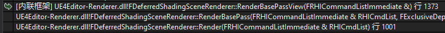
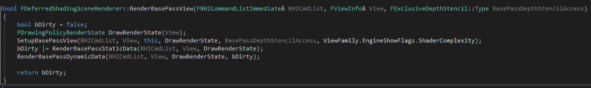

<!-- TOC -->

- [RenderBasePassStaticData](#renderbasepassstaticdata)
- [RenderBasePassDynamicData](#renderbasepassdynamicdata)

<!-- /TOC -->

根据调用堆栈直接进入FDeferredShadingSceneRenderer::RenderBasePassView



FDeferredShadingSceneRenderer::RenderBasePassView中先执行SetupBasePassView，再执行RenderBasePassStaticData和RenderBasePassDynamicData



SetupBasePassView中设置Blend、DepthStencil、Viewport等

```cpp
...
if (bShaderComplexity)
{
	// Additive blending when shader complexity viewmode is enabled.
	DrawRenderState.SetBlendState(TStaticBlendState<CW_RGBA, BO_Add, BF_One, BF_One, BO_Add, BF_Zero, BF_One>::GetRHI());
	// Disable depth writes as we have a full depth prepass.
	DrawRenderState.SetDepthStencilState(TStaticDepthStencilState<false, CF_DepthNearOrEqual>::GetRHI());
}
...
if (!View.IsInstancedStereoPass() || bIsEditorPrimitivePass)
{
	RHICmdList.SetViewport(View.ViewRect.Min.X, View.ViewRect.Min.Y, 0.0f, View.ViewRect.Max.X, View.ViewRect.Max.Y, 1.0f);
}
...
```
## RenderBasePassStaticData

RenderBasePassStaticData中根据是否是EarlyZPassMode决定如何调用RenderBasePassStaticDataType

```cpp
// When using a depth-only pass, the default opaque geometry's depths are already
// in the depth buffer at this point, so rendering masked next will already cull
// as efficiently as it can, while also increasing the ZCull efficiency when
// rendering the default opaque geometry afterward.
if (EarlyZPassMode != DDM_None)
{
	bDirty |= RenderBasePassStaticDataType(RHICmdList, View, DrawRenderState, EBasePass_Masked);
	bDirty |= RenderBasePassStaticDataType(RHICmdList, View, DrawRenderState, EBasePass_Default);
}
else
{
	// Otherwise, in the case where we're not using a depth-only pre-pass, there
	// is an advantage to rendering default opaque first to help cull the more
	// expensive masked geometry.
	bDirty |= RenderBasePassStaticDataType(RHICmdList, View, DrawRenderState, EBasePass_Default);
	bDirty |= RenderBasePassStaticDataType(RHICmdList, View, DrawRenderState, EBasePass_Masked);
}
```

在RenderBasePassStaticDataType中根据传入的EBasePassDrawListType调用对应的DrawList进行绘制

```cpp
if (!View.IsInstancedStereoPass())
{
	bDirty |= Scene->BasePassUniformLightMapPolicyDrawList[DrawType].DrawVisible(RHICmdList, View, DrawRenderState, View.StaticMeshVisibilityMap, View.StaticMeshBatchVisibility);
}
else
{
	const StereoPair StereoView(Views[0], Views[1], Views[0].StaticMeshVisibilityMap, Views[1].StaticMeshVisibilityMap, Views[0].StaticMeshBatchVisibility, Views[1].StaticMeshBatchVisibility);
	bDirty |= Scene->BasePassUniformLightMapPolicyDrawList[DrawType].DrawVisibleInstancedStereo(RHICmdList, StereoView, DrawRenderState);
}
```

BasePassRendering中，会调用RenderBasePassStaticDataType绘制静态物体

```cpp
bool FDeferredShadingSceneRenderer::RenderBasePassView(FRHICommandListImmediate& RHICmdList, FViewInfo& View, FExclusiveDepthStencil::Type BasePassDepthStencilAccess)
{
	bool bDirty = false; 
	FDrawingPolicyRenderState DrawRenderState(View);
	SetupBasePassView(RHICmdList, View, this, DrawRenderState, BasePassDepthStencilAccess, ViewFamily.EngineShowFlags.ShaderComplexity);
	bDirty |= RenderBasePassStaticData(RHICmdList, View, DrawRenderState);
	RenderBasePassDynamicData(RHICmdList, View, DrawRenderState, bDirty);

	return bDirty;
}
```
RenderBasePassStaticData中继续调用

```cpp
if (EarlyZPassMode != DDM_None)
	{
		bDirty |= RenderBasePassStaticDataType(RHICmdList, View, DrawRenderState, EBasePass_Masked);
		bDirty |= RenderBasePassStaticDataType(RHICmdList, View, DrawRenderState, EBasePass_Default);
	}
	else
	{
		// Otherwise, in the case where we're not using a depth-only pre-pass, there
		// is an advantage to rendering default opaque first to help cull the more
		// expensive masked geometry.
		bDirty |= RenderBasePassStaticDataType(RHICmdList, View, DrawRenderState, EBasePass_Default);
		bDirty |= RenderBasePassStaticDataType(RHICmdList, View, DrawRenderState, EBasePass_Masked);
	}
```

RenderBasePassStaticDataType中调用BasePassUniformLightMapPolicyDrawList的DrawVisible

```cpp
bool FDeferredShadingSceneRenderer::RenderBasePassStaticDataType(FRHICommandList& RHICmdList, FViewInfo& View, const FDrawingPolicyRenderState& DrawRenderState, const EBasePassDrawListType DrawType)
{
	SCOPED_DRAW_EVENTF(RHICmdList, StaticType, TEXT("Static EBasePassDrawListType=%d"), DrawType);

	bool bDirty = false;

	if (!View.IsInstancedStereoPass())
	{
		bDirty |= Scene->BasePassUniformLightMapPolicyDrawList[DrawType].DrawVisible(RHICmdList, View, DrawRenderState, View.StaticMeshVisibilityMap, View.StaticMeshBatchVisibility);
	}
	else
	{
		const StereoPair StereoView(Views[0], Views[1], Views[0].StaticMeshVisibilityMap, Views[1].StaticMeshVisibilityMap, Views[0].StaticMeshBatchVisibility, Views[1].StaticMeshBatchVisibility);
		bDirty |= Scene->BasePassUniformLightMapPolicyDrawList[DrawType].DrawVisibleInstancedStereo(RHICmdList, StereoView, DrawRenderState);
	}

	return bDirty;
}
```

最终会调用模板版的DrawVisible

```cpp
template<typename DrawingPolicyType>
bool TStaticMeshDrawList<DrawingPolicyType>::DrawVisible(
	FRHICommandList& RHICmdList,
	const FViewInfo& View,
	const typename DrawingPolicyType::ContextDataType PolicyContext,
	const FDrawingPolicyRenderState& DrawRenderState,
	const TBitArray<SceneRenderingBitArrayAllocator>& StaticMeshVisibilityMap,
	const TArray<uint64,SceneRenderingAllocator>& BatchVisibilityArray
	)
{
	//moved out of the inner loop and only modified if bDrawnShared
	FDrawingPolicyRenderState DrawRenderStateLocal(DrawRenderState);

	return DrawVisibleInner<InstancedStereoPolicy::Disabled>(RHICmdList, View, PolicyContext, DrawRenderStateLocal, &StaticMeshVisibilityMap, &BatchVisibilityArray, nullptr, 0, OrderedDrawingPolicies.Num() - 1, false);
}
```

在DrawVisibleInner中，根据当前所有的DrawingPolicyLink依次调用DrawElement。DrawElement如下：

```cpp
template<typename DrawingPolicyType>
template<InstancedStereoPolicy InstancedStereo>
int32 TStaticMeshDrawList<DrawingPolicyType>::DrawElement(
	FRHICommandList& RHICmdList,
	const FViewInfo& View,
	const typename DrawingPolicyType::ContextDataType PolicyContext,
	FDrawingPolicyRenderState& DrawRenderState,
	const FElement& Element,
	uint64 BatchElementMask,
	FDrawingPolicyLink* DrawingPolicyLink,
	bool& bDrawnShared
	)
```

DrawElement中，先根据传入的DrawingPolicyLink设置图形管线状态等，例如：

```cpp
...
CommitGraphicsPipelineState(RHICmdList, DrawingPolicyLink->DrawingPolicy, DrawRenderState, BoundShaderStateInput);
...
```

最终调用DrawingPolicyLink中DrawingPolicy的DrawMesh。
```cpp
...
DrawingPolicyLink->DrawingPolicy.SetMeshRenderState(
	RHICmdList,
	View,
	Proxy,
	*Element.Mesh,
	BatchElementIndex,
	DrawRenderState,
	Element.PolicyData,
	PolicyContext
);

DrawingPolicyLink->DrawingPolicy.DrawMesh(RHICmdList, View, *Element.Mesh, BatchElementIndex, true);
...
```

这里为FMeshDrawingPolicy::DrawMesh，其最终会调用FRHICommandList::DrawIndexedPrimitive，传入FMeshBatch信息进行绘制

```cpp
...
const FMeshBatchElement& BatchElement = Mesh.Elements[BatchElementIndex];
...
RHICmdList.DrawIndexedPrimitive(
	BatchElement.IndexBuffer->IndexBufferRHI,
	Mesh.Type,
	BatchElement.BaseVertexIndex,
	0,
	BatchElement.MaxVertexIndex - BatchElement.MinVertexIndex + 1,
	BatchElement.FirstIndex,
	BatchElement.NumPrimitives,
	InstanceCount * GetInstanceFactor()
);
...
```

## RenderBasePassDynamicData

BasePassRendering中，会调用RenderBasePassDynamicData绘制动态物体。RenderBasePassDynamicData中，从FViewInfo中获取需要绘制的MeshBatch

```cpp
for (int32 MeshBatchIndex = 0; MeshBatchIndex < View.DynamicMeshElements.Num(); MeshBatchIndex++)
{
	const FMeshBatchAndRelevance& MeshBatchAndRelevance = View.DynamicMeshElements[MeshBatchIndex];

	if ((MeshBatchAndRelevance.GetHasOpaqueOrMaskedMaterial() || ViewFamily.EngineShowFlags.Wireframe)
		&& MeshBatchAndRelevance.GetRenderInMainPass()
		//#nv begin #flex
#if WITH_FLEX
		&& MeshBatchAndRelevance.Mesh->bRenderable
#endif
		//#nv end
		)
	{
		const FMeshBatch& MeshBatch = *MeshBatchAndRelevance.Mesh;
		FBasePassOpaqueDrawingPolicyFactory::DrawDynamicMesh(RHICmdList, View, Context, MeshBatch, true, DrawRenderState, MeshBatchAndRelevance.PrimitiveSceneProxy, MeshBatch.BatchHitProxyId, View.IsInstancedStereoPass());
	}
}
```

FBasePassOpaqueDrawingPolicyFactory::DrawDynamicMesh中，对非透明物体调用ProcessBasePassMesh（[UE4_AddPrimitive](UE4_AddPrimitive.md)中也用到了，但传入的是FDrawBasePassStaticMeshAction）。

```cpp
ProcessBasePassMesh(
	RHICmdList,
	FProcessBasePassMeshParameters(
		Mesh,
		Material,
		PrimitiveSceneProxy,
		!bPreFog,
		DrawingContext.TextureMode,
		View.GetFeatureLevel(),
		bIsInstancedStereo
	),
	FDrawBasePassDynamicMeshAction(
		RHICmdList,
		View,
		Mesh.DitheredLODTransitionAlpha,
		DrawRenderState,
		HitProxyId
	)
);
```

因此同样会调用Action的Process函数。FDrawBasePassDynamicMeshAction::Process中，利用TBasePassDrawingPolicy

```cpp
...
TBasePassDrawingPolicy<LightMapPolicyType> DrawingPolicy(
	Parameters.Mesh.VertexFactory,
	Parameters.Mesh.MaterialRenderProxy,
	*Parameters.Material,
	Parameters.FeatureLevel,
	LightMapPolicy,
	Parameters.BlendMode,
	Parameters.TextureMode,
	bRenderSkylight,
	bRenderAtmosphericFog,
	ComputeMeshOverrideSettings(Parameters.Mesh),
	View.Family->GetDebugViewShaderMode(),
	bEnableReceiveDecalOutput
);
...
DrawingPolicy.SetupPipelineState(DrawRenderState, View);
...
DrawingPolicy.SetSharedState(RHICmdList, DrawRenderState, &View, typename TBasePassDrawingPolicy<LightMapPolicyType>::ContextDataType(Parameters.bIsInstancedStereo));
...
for (int32 BatchElementIndex = 0, Num = Parameters.Mesh.Elements.Num(); BatchElementIndex < Num; BatchElementIndex++)
{
	// We draw instanced static meshes twice when rendering with instanced stereo. Once for each eye.
	const bool bIsInstancedMesh = Parameters.Mesh.Elements[BatchElementIndex].bIsInstancedMesh;
	const uint32 InstancedStereoDrawCount = (Parameters.bIsInstancedStereo && bIsInstancedMesh) ? 2 : 1;
	for (uint32 DrawCountIter = 0; DrawCountIter < InstancedStereoDrawCount; ++DrawCountIter)
	{
		DrawingPolicy.SetInstancedEyeIndex(RHICmdList, DrawCountIter);

		TDrawEvent<FRHICommandList> MeshEvent;
		BeginMeshDrawEvent(RHICmdList, Parameters.PrimitiveSceneProxy, Parameters.Mesh, MeshEvent, EnumHasAnyFlags(EShowMaterialDrawEventTypes(GShowMaterialDrawEventTypes), EShowMaterialDrawEventTypes::BasePass));

		DrawingPolicy.SetMeshRenderState(
			RHICmdList,
			View,
			Parameters.PrimitiveSceneProxy,
			Parameters.Mesh,
			BatchElementIndex,
			DrawRenderState,
			typename TBasePassDrawingPolicy<LightMapPolicyType>::ElementDataType(LightMapElementData),
			typename TBasePassDrawingPolicy<LightMapPolicyType>::ContextDataType()
		);
		DrawingPolicy.DrawMesh(RHICmdList, View, Parameters.Mesh, BatchElementIndex, Parameters.bIsInstancedStereo);
	}
}
...
```

最后调用的DrawingPolicy.DrawMesh，即FMeshDrawingPolicy::DrawMesh，与RenderBasePassStaticData阶段相同。