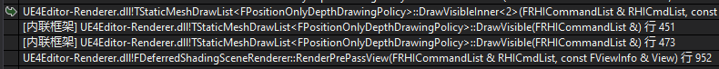
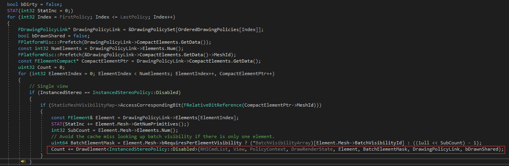
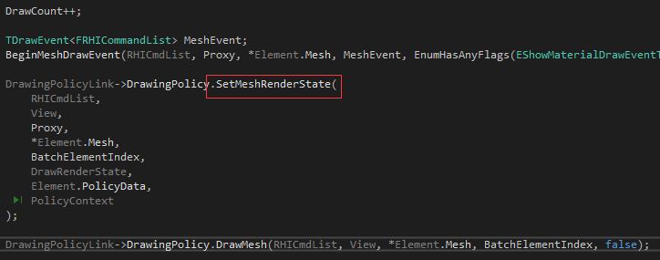
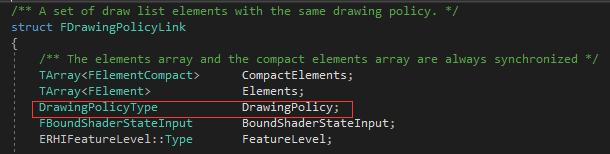
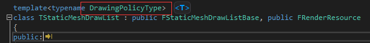
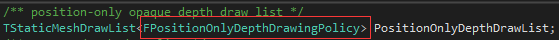
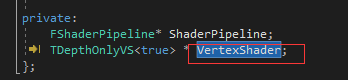
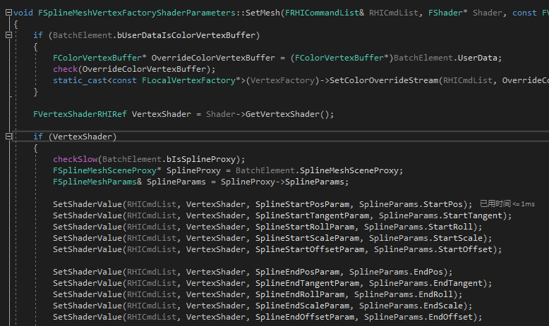

## Scene->PositionOnlyDepthDrawList.DrawVisible
* RenderPrePassView 
  * Scene->PositionOnlyDepthDrawList.DrawVisible
    * TStaticMeshDrawList\<FPositionOnlyDepthDrawingPolicy>::DrawVisibleInner
      * TStaticMeshDrawList\<FPositionOnlyDepthDrawingPolicy>::DrawElement
        * FPositionOnlyDepthDrawingPolicy::SetMeshRenderState
          * TDepthOnlyVS::SetMesh
  * Scene->DepthDrawList.DrawVisible
    * TStaticMeshDrawList\<FDepthDrawingPolicy>::DrawVisibleInner
      * TStaticMeshDrawList\<FDepthDrawingPolicy>::DrawElement
        * FDepthDrawingPolicy::SetMeshRenderState
          * 

F_Name_DrawingPolicy::SetMeshRenderState中，调用_Name_Shader::SetMesh，设置Shader中的变量值

以SplineMesh为例：
RenderPrePassView阶段，先绘制PositionOnlyDrawList中的对象，依次调用进入DrawVisibleInner中

在DrawVisibleInner中若需要Draw，则调用DrawElement

DrawElement中依次调用相应DrawingPolicy的SetMeshRenderState和DrawMesh

这里的DrawingPolicy是被封装进FDrawingPolicyLink的DrawingPolicyType，即PositionOnlyDepthDrawList声明时传入的模板类型，为FPositionOnlyDepthDrawingPolicy

FPositionOnlyDepthDrawingPolicy::SetMeshRenderState中调用其VertexShader的SetMesh，FPositionOnlyDepthDrawingPolicy的VertexShader为TDepthOnlyVS类型

TDepthOnlyVS::SetMesh中调用其父类FMeshMaterialShader的SetMesh，FMeshMaterialShader::SetMesh中，先调用FVertexFactoryParameterRef::SetMesh，这里FVertexFactoryParameterRef封装的是FSplineMeshVertexFactoryShaderParameters，继续调用FSplineMeshVertexFactoryShaderParameters::SetMesh

FSplineMeshVertexFactoryShaderParameters::SetMesh中更新SplineMesh的StartPos、StartTangent等数据

FPositionOnlyDepthDrawingPolicy中没有重写DrawMesh，继续调用FMeshDrawingPolicy::DrawMesh，DrawMesh中调用FRHICommandList::DrawIndexedPrimitive进行绘制