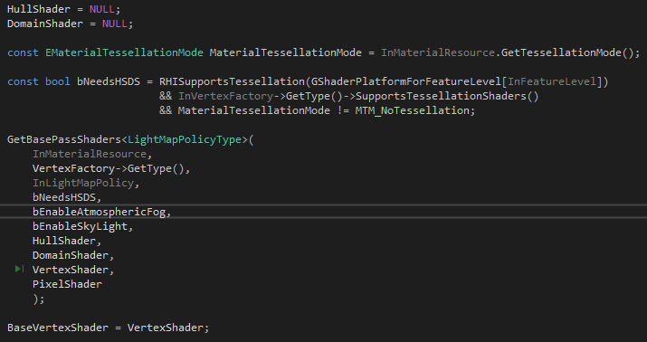

以TBasePassDrawingPolicy为例，各种Shader类型的指针为其成员

```cpp
// Here we don't store the most derived type of shaders, for instance TBasePassVertexShaderBaseType<LightMapPolicyType>.
// This is to allow any shader using the same parameters to be used, and is required to allow FUniformLightMapPolicy to use shaders derived from TUniformLightMapPolicy.
TBasePassVertexShaderPolicyParamType<typename LightMapPolicyType::VertexParametersType>* VertexShader;
FBaseHS* HullShader; // Does not depend on LightMapPolicyType
FBaseDS* DomainShader; // Does not depend on LightMapPolicyType
TBasePassPixelShaderPolicyParamType<typename LightMapPolicyType::PixelParametersType>* PixelShader;
```

在构造函数中，通过GetBasePassShaders初始化这些指针



GetBasePassShaders中，通过Material根据VertexFactoryType获取对应的Shader


这里的Material是FMaterial类型，引擎启动时会加载DCC中的Shader，见[UE4_UMaterial_CacheShader](UE4_UMaterial_CacheShader.md)

DrawingPolicy中包含SetMeshRenderState、DrawMesh等方法，用于更新Shader的状态、执行绘制等，在DrawList进行绘制时，会调用对应DrawingPolicy的方法，见[UE_DrawList](UE4_DrawList.md)

