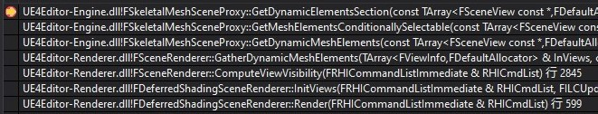

<!-- TOC -->

- [Render](#render)
	- [InitViews](#initviews)
		- [ComputeViewVisibility](#computeviewvisibility)
	- [RenderPrePass](#renderprepass)

<!-- /TOC -->
# Render
* Render
* *Prepare*
  * InitViews
    * ComputeViewVisibility
      * FrustumCulling
      * OcclusionCull
    * CreateIndirectCapsuleShadows
    * PostVisibilityFrameSetup
    * SortBasePassStaticData
    * PostInitViewCustomData
  * GetEyeAdaptation
  * UpdateGPUScene
  * PrepareDistanceFieldScene
    * UpdateGlobalDistanceFieldObjectBuffers
    * UpdateGlobalDistanceFieldVolume
* *Commit dynamic vertex and index buffers befor rendering*
* FXSystem->PreRender
* GPUSkinCache->TransitionAllToReadable
* RenderPrePass


## InitViews
### ComputeViewVisibility

调用如下



每个PrimitiveComponent添加到场景中后，在CreateRenderState_Concurrent阶段根据条件被添加到Scene的Primitives中

```cpp
void UPrimitiveComponent::CreateRenderState_Concurrent()
{
	...
	// If the primitive isn't hidden and the detail mode setting allows it, add it to the scene.
	if (ShouldComponentAddToScene())
	{
		GetWorld()->Scene->AddPrimitive(this);
	}
	...
}
```

ComputeViewVisibility中，先完成各种cull，更新View.PrimitiveVisibilityMap

```cpp
void FSceneRenderer::ComputeViewVisibility(FRHICommandListImmediate& RHICmdList)
{
	...
	// Occlusion cull for all primitives in the view frustum, but not in wireframe.
	if (!View.Family->EngineShowFlags.Wireframe)
	{
		int32 NumOccludedPrimitivesInView = OcclusionCull(RHICmdList, Scene, View);
		STAT(NumOccludedPrimitives += NumOccludedPrimitivesInView);
	}
    ...
}
```

使用FPrimitiveViewMasks存储各种情况下场景中Primitives的可见性

```cpp
void FSceneRenderer::ComputeViewVisibility(FRHICommandListImmediate& RHICmdList)
{
	...
	FPrimitiveViewMasks HasDynamicMeshElementsMasks;
	HasDynamicMeshElementsMasks.AddZeroed(NumPrimitives);

	FPrimitiveViewMasks HasViewCustomDataMasks;
	HasViewCustomDataMasks.AddZeroed(NumPrimitives);

	FPrimitiveViewMasks HasDynamicEditorMeshElementsMasks;
	...
	{
		SCOPE_CYCLE_COUNTER(STAT_ViewRelevance);
		ComputeAndMarkRelevanceForViewParallel(RHICmdList, Scene, View, ViewBit, HasDynamicMeshElementsMasks, HasDynamicEditorMeshElementsMasks, HasViewCustomDataMasks);
	}
	...
}
```

在ComputeAndMarkRelevanceForViewParallel中，使用FRelevancePacket类将HasDynamicMeshElementsMasks等信息打包

```cpp
static void ComputeAndMarkRelevanceForViewParallel(
	FRHICommandListImmediate& RHICmdList,
	const FScene* Scene,
	FViewInfo& View,
	uint8 ViewBit,
	FPrimitiveViewMasks& OutHasDynamicMeshElementsMasks,
	FPrimitiveViewMasks& OutHasDynamicEditorMeshElementsMasks,
	FPrimitiveViewMasks& HasViewCustomDataMasks
	)
{
	...
	TArray<FRelevancePacket*,SceneRenderingAllocator> Packets;
	...
	FRelevancePacket* Packet = new(FMemStack::Get()) 	FRelevancePacket(
		RHICmdList,
		Scene,
		View,
		ViewBit,
		ViewData,
		OutHasDynamicMeshElementsMasks,
		OutHasDynamicEditorMeshElementsMasks,
		MarkMasks,
		WillExecuteInParallel ? View.AllocateCustomDataMemStack() : View.GetCustomDataGlobalMemStack(),
		HasViewCustomDataMasks);
	Packets.Add(Packet);
	...
}
```

并将View.PrimitiveVisibilityMap中的可见的对象Index存储到FRelevancePacket的Input成员中
```cpp
struct FRelevancePacket
{
	...
	FRelevancePrimSet<int32> Input;
	...
}

static void ComputeAndMarkRelevanceForViewParallel(
	FRHICommandListImmediate& RHICmdList,
	const FScene* Scene,
	FViewInfo& View,
	uint8 ViewBit,
	FPrimitiveViewMasks& OutHasDynamicMeshElementsMasks,
	FPrimitiveViewMasks& OutHasDynamicEditorMeshElementsMasks,
	FPrimitiveViewMasks& HasViewCustomDataMasks
	)
{
	...
	FSceneSetBitIterator BitIt(View.PrimitiveVisibilityMap);
	...
	while(1)
	{
		Packet->Input.AddPrim(BitIt.GetIndex());
		++BitIt;
		...
	}
}
```

（这里的FSceneSetBitIterator迭代器还没看，AddPrim时好像会过滤掉PrimitiveVisibilityMap中值为0的元素）接着利用多线程进行处理

```cpp
static void ComputeAndMarkRelevanceForViewParallel(
	FRHICommandListImmediate& RHICmdList,
	const FScene* Scene,
	FViewInfo& View,
	uint8 ViewBit,
	FPrimitiveViewMasks& OutHasDynamicMeshElementsMasks,
	FPrimitiveViewMasks& OutHasDynamicEditorMeshElementsMasks,
	FPrimitiveViewMasks& HasViewCustomDataMasks
	)
{
	...
	{
		QUICK_SCOPE_CYCLE_COUNTER(STAT_ComputeAndMarkRelevanceForViewParallel_ParallelFor);
		ParallelFor(Packets.Num(), 
			[&Packets](int32 Index)
			{
				Packets[Index]->AnyThreadTask();
			},
			!WillExecuteInParallel
		);
	}
	...
}
```

AnyThreadTask中做了两件事情，Compute和Mark
```cpp
void AnyThreadTask()
{
	ComputeRelevance();
	MarkRelevant();
}
```

然后，在ComputeViewVisibility中，通过GatherDynamicMeshElements获取可见的DynamicMeshElements的信息

```cpp
void FSceneRenderer::ComputeViewVisibility(FRHICommandListImmediate& RHICmdList)
{
	...
    GatherDynamicMeshElements(Views, Scene, ViewFamily, HasDynamicMeshElementsMasks, HasDynamicEditorMeshElementsMasks, HasViewCustomDataMasks, MeshCollector);
    ...
}

```

GatherDynamicMeshElements中获取FScene中存储的Proxy，根据HasDynamicMeshElementsMasks决定是否调用GetDynamicMeshElements，在GetDynamicMeshElements中向Collector添加绘制的mesh信息

* GatherDynamicMeshElements

```cpp
void FSceneRenderer::GatherDynamicMeshElements(
	TArray<FViewInfo>& InViews, 
	const FScene* InScene, 
	const FSceneViewFamily& InViewFamily, 
	const FPrimitiveViewMasks& HasDynamicMeshElementsMasks, 
	const FPrimitiveViewMasks& HasDynamicEditorMeshElementsMasks, 
	const FPrimitiveViewMasks& HasViewCustomDataMasks,
	FMeshElementCollector& Collector)
    {
        ...
        FPrimitiveSceneInfo* PrimitiveSceneInfo = InScene->Primitives[PrimitiveIndex];
        ...
		if (ViewMask != 0)
		{
			...
        	PrimitiveSceneInfo->Proxy->GetDynamicMeshElements(InViewFamily.Views, InViewFamily, ViewMaskFinal, Collector);
		}
        ...
    }

```

* GetDynamicMeshElements

```cpp
virtual void GetDynamicMeshElements(
		const TArray<const FSceneView*>& Views,
		const FSceneViewFamily& ViewFamily,
		uint32 VisibilityMap,
		FMeshElementCollector& Collector
	) const override
    {
        ...
        for (int32 ViewIndex = 0; ViewIndex < Views.Num(); ++ViewIndex)
		{
			if (VisibilityMap&(1 << ViewIndex))
			{
				const FSceneView* View = Views[ViewIndex];
				// Draw the mesh
				FMeshBatch& Mesh = Collector.AllocateMesh();
				FMeshBatchElement& BatchElement = Mesh.Elements[0];
				BatchElement.IndexBuffer = &IndexBuffer;
				Mesh.bWireframe = bWireframe;
				Mesh.VertexFactory = &VertexFactory;
				Mesh.MaterialRenderProxy = MaterialProxy;
				BatchElement.PrimitiveUniformBuffer = CreatePrimitiveUniformBufferImmediate(
					GetLocalToWorld(),
					GetBounds(),
					GetLocalBounds(),
					true,
					UseEditorDepthTest()
				);
				BatchElement.FirstIndex = 0;
				BatchElement.NumPrimitives = GetRequiredIndexCount() / 3;
				BatchElement.MinVertexIndex = 0;
				BatchElement.MaxVertexIndex = GetRequiredVertexCount();
				Mesh.ReverseCulling = IsLocalToWorldDeterminantNegative();
				Mesh.DepthPriorityGroup = SDPG_World;
				Mesh.bCanApplyViewModeOverrides = false;
				Collector.AddMesh(ViewIndex, Mesh);
			}
		}
        ...
    }
```

## RenderPrePass
RenderPrePass中会先执行PreRenderPrePass，在FDeferredShadingSceneRenderer::PreRenderPrePass中可以看到如何使用shader。
```cpp
for (int32 ViewIndex = 0; ViewIndex < Views.Num(); ++ViewIndex)
{
	SCOPED_CONDITIONAL_DRAW_EVENTF(RHICmdList, EventView, Views.Num() > 1, TEXT("View%d"), ViewIndex);

	FViewInfo& View = Views[ViewIndex];
	RHICmdList.SetViewport(View.ViewRect.Min.X, View.ViewRect.Min.Y, 0.0f, View.ViewRect.Max.X, View.ViewRect.Max.Y, 1.0f);

	// Set shaders, states
	TShaderMapRef<FScreenVS> ScreenVertexShader(View.ShaderMap);
	TShaderMapRef<FDitheredTransitionStencilPS> PixelShader(View.ShaderMap);

	extern TGlobalResource<FFilterVertexDeclaration> GFilterVertexDeclaration;
	GraphicsPSOInit.BoundShaderState.VertexDeclarationRHI = GFilterVertexDeclaration.VertexDeclarationRHI;
	GraphicsPSOInit.BoundShaderState.VertexShaderRHI = GETSAFERHISHADER_VERTEX(*ScreenVertexShader);
	GraphicsPSOInit.BoundShaderState.PixelShaderRHI = GETSAFERHISHADER_PIXEL(*PixelShader);
	GraphicsPSOInit.PrimitiveType = PT_TriangleList;

	SetGraphicsPipelineState(RHICmdList, GraphicsPSOInit);
	RHICmdList.SetStencilRef(STENCIL_SANDBOX_MASK);

	PixelShader->SetParameters(RHICmdList, View);

	DrawRectangle(
		RHICmdList,
		0, 0,
		BufferSizeXY.X, BufferSizeXY.Y,
		View.ViewRect.Min.X, View.ViewRect.Min.Y,
		View.ViewRect.Width(), View.ViewRect.Height(),
		BufferSizeXY,
		BufferSizeXY,
		*ScreenVertexShader,
		EDRF_UseTriangleOptimization);
}
```