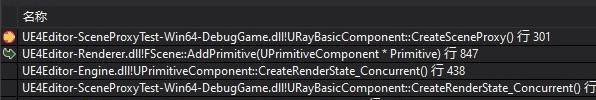
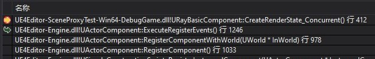

<!-- TOC -->

- [SkinnedMeshComponent](#skinnedmeshcomponent)
	- [USkeletalMesh](#uskeletalmesh)
		- [FReferenceSkeleton](#freferenceskeleton)
	- [GetCPUSkinnedVertices](#getcpuskinnedvertices)
	- [FSkeletaMeshRenderData](#fskeletameshrenderdata)
	- [USkinnedMeshComponent::CreateSceneProxy()](#uskinnedmeshcomponentcreatesceneproxy)
	- [USkinnedMeshComponent::CreateRenderState_Concurrent()](#uskinnedmeshcomponentcreaterenderstateconcurrent)
	- [USkinnedMeshComponent::SendRenderDynamicData_Concurrent()](#uskinnedmeshcomponentsendrenderdynamicdataconcurrent)
	- [FSkeletalMeshSceneProxy::GetDynamicMeshElements()](#fskeletalmeshsceneproxygetdynamicmeshelements)

<!-- /TOC -->

# SkinnedMeshComponent

USkeletalMesh * SkeletalMesh (bone, pose)

void GetCPUSkinnedVertices(TArray<struct FFinalSkinVertex>& OutVertices, int32 InLODIndex);

## USkeletalMesh
FReferenceSkeleton RefSkeleton;

### FReferenceSkeleton
```cpp
/** Reference Skeleton **/
struct FReferenceSkeleton
{
    //RAW BONES: Bones that exist in the original asset
	/** Reference bone related info to be serialized **/
	TArray<FMeshBoneInfo>	RawRefBoneInfo;
	/** Reference bone transform **/
	TArray<FTransform>		RawRefBonePose;

	//FINAL BONES: Bones for this skeleton including user added virtual bones
	/** Reference bone related info to be serialized **/
	TArray<FMeshBoneInfo>	FinalRefBoneInfo;
	/** Reference bone transform **/
	TArray<FTransform>		FinalRefBonePose;

	/** TMap to look up bone index from bone name. */
	TMap<FName, int32>		RawNameToIndexMap;
	TMap<FName, int32>		FinalNameToIndexMap;

	// cached data to allow virtual bones to be built into poses
	TArray<FBoneIndexType>  RequiredVirtualBones;
	TArray<FVirtualBoneRefData> UsedVirtualBoneData;
}
```

## GetCPUSkinnedVertices

## FSkeletaMeshRenderData
FSkeletaMeshRenderData包含LODRenderData、UVChannelDataPerMaterial

```cpp
/** Per-LOD render data. */
TIndirectArray<FSkeletalMeshLODRenderData> LODRenderData;

#if WITH_EDITORONLY_DATA
/** UV data used for streaming accuracy debug view modes. In sync for rendering thread */
TArray<FMeshUVChannelInfo> UVChannelDataPerMaterial;
#endif
```
这里的TIndirectArray与TArray一样，不同的是TIndirectArray存储的是元素的指针，便于在不重新定位实际元素的情况下调整array的index大小。

## USkinnedMeshComponent::CreateSceneProxy()
```cpp
FPrimitiveSceneProxy* USkinnedMeshComponent::CreateSceneProxy()
{
	ERHIFeatureLevel::Type SceneFeatureLevel = GetWorld()->FeatureLevel;
	FSkeletalMeshSceneProxy* Result = nullptr;
	FSkeletalMeshRenderData* SkelMeshRenderData = GetSkeletalMeshRenderData();

	// Only create a scene proxy for rendering if properly initialized
	if (SkelMeshRenderData &&
		SkelMeshRenderData->LODRenderData.IsValidIndex(PredictedLODLevel) &&
		!bHideSkin &&
		MeshObject)
	{
		// Only create a scene proxy if the bone count being used is supported, or if we don't have a skeleton (this is the case with destructibles)
		int32 MaxBonesPerChunk = SkelMeshRenderData->GetMaxBonesPerSection();
		if (MaxBonesPerChunk <= GetFeatureLevelMaxNumberOfBones(SceneFeatureLevel))
		{
			Result = ::new FSkeletalMeshSceneProxy(this, SkelMeshRenderData);
		}
	}

#if !(UE_BUILD_SHIPPING || UE_BUILD_TEST)
	SendRenderDebugPhysics(Result);
#endif

	return Result;
}
```
通过GetSkeletalMeshRenderData()获取SkeletalMeshRenderData
```cpp
FSkeletalMeshRenderData* USkinnedMeshComponent::GetSkeletalMeshRenderData() const
{
	if (MeshObject)
	{
		return &MeshObject->GetSkeletalMeshRenderData();
	}
	else if (SkeletalMesh)
	{
		return SkeletalMesh->GetResourceForRendering();
	}
	else
	{
		return NULL;
	}
}
```
若MaxBonesPerChunk在支持的数量访问内，实例化对应的SceneProxy。
CreateSceneProxy在PrimitiveComponent被放入RenderScene时调用

```cpp
void FScene::AddPrimitive(UPrimitiveComponent* Primitive)
{
	// ...
	// Create the primitive's scene proxy.
	FPrimitiveSceneProxy* PrimitiveSceneProxy = Primitive->CreateSceneProxy();
	Primitive->SceneProxy = PrimitiveSceneProxy;
	// ...
}
```
## USkinnedMeshComponent::CreateRenderState_Concurrent()
CreateRenderState_Concurrent在Component被Register时执行

## USkinnedMeshComponent::SendRenderDynamicData_Concurrent()
在TickComponent中执行MarkRenderDynamicDataDirty()后执行，更新Render所需要的DynamicData

## FSkeletalMeshSceneProxy::GetDynamicMeshElements()
渲染过程中，通过GetDynamicMeshElements获取渲染所需的信息
```cpp
void FSkeletalMeshSceneProxy::GetDynamicMeshElements(const TArray<const FSceneView*>& Views, const FSceneViewFamily& ViewFamily, uint32 VisibilityMap, FMeshElementCollector& Collector) const
{
	QUICK_SCOPE_CYCLE_COUNTER(STAT_FSkeletalMeshSceneProxy_GetMeshElements);
	GetMeshElementsConditionallySelectable(Views, ViewFamily, true, VisibilityMap, Collector);
}
```