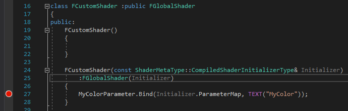

FXXShader类的构造函数设断点进不去


核心计算代码，根据样条首尾两个端点的变换，插值计算样条上任意位置的变换，并应用到该位置的frenet坐标系上
```cpp
/** Calculate full transform that defines frame along spline, given the Z of a vertex. */
float4x3 CalcSliceTransform(float ZPos)
{
	// Find how far 'along' mesh we are
	float Alpha = ZPos * SplineMeshScaleZ - SplineMeshMinZ;

	// Apply hermite interp to Alpha if desired
	float HermiteAlpha = SmoothInterpRollScale ? smoothstep(0.0, 1.0, Alpha) : Alpha;

	// Then find the point and direction of the spline at this point along
	float3 SplinePos = SplineEvalPos(SplineStartPos, SplineStartTangent, SplineEndPos, SplineEndTangent, Alpha);
	float3 SplineDir = SplineEvalDir(SplineStartPos, SplineStartTangent, SplineEndPos, SplineEndTangent, Alpha);

	// Find base frenet frame
	float3 BaseXVec = normalize(cross(SplineUpDir, SplineDir));
	float3 BaseYVec = normalize(cross(SplineDir, BaseXVec));

	// Offset from the spline, using the frenet frame
	float2 SliceOffset = lerp(SplineStartOffset, SplineEndOffset, HermiteAlpha);
	SplinePos += SliceOffset.x * BaseXVec;
	SplinePos += SliceOffset.y * BaseYVec;

	// Apply roll to frame around spline
	float UseRoll = lerp(SplineStartRoll, SplineEndRoll, HermiteAlpha);
	float SinAng, CosAng;
	sincos(UseRoll, SinAng, CosAng);
	float3 XVec = (CosAng * BaseXVec) - (SinAng * BaseYVec);
	float3 YVec = (CosAng * BaseYVec) + (SinAng * BaseXVec);

	// Find scale at this point along spline
	float2 UseScale = lerp(SplineStartScale, SplineEndScale, HermiteAlpha);

	XVec *= UseScale.x;
	YVec *= UseScale.y;

	// Build overall transform
	float3x3 SliceTransform3 = mul(transpose(float3x3(SplineMeshDir, SplineMeshX, SplineMeshY)), float3x3(float3(0, 0, 0), XVec, YVec));
	float4x3 SliceTransform = float4x3(SliceTransform3[0], SliceTransform3[1], SliceTransform3[2], SplinePos);

	return SliceTransform;
}
```

SplineMeshScaleZ和SplineMeshMinZ的计算：
```cpp
void USplineMeshComponent::CalculateScaleZAndMinZ(float& OutScaleZ, float& OutMinZ) const
{
	if (GetStaticMesh())
	{
		if (FMath::IsNearlyEqual(SplineBoundaryMin, SplineBoundaryMax))
		{
			FBoxSphereBounds StaticMeshBounds = GetStaticMesh()->GetBounds();
			OutScaleZ = 0.5f / USplineMeshComponent::GetAxisValue(StaticMeshBounds.BoxExtent, ForwardAxis); // 1/(2 * Extent)
			OutMinZ = USplineMeshComponent::GetAxisValue(StaticMeshBounds.Origin, ForwardAxis) * OutScaleZ - 0.5f;
		}
		else
		{
			OutScaleZ = 1.0f / (SplineBoundaryMax - SplineBoundaryMin);
			OutMinZ = SplineBoundaryMin * OutScaleZ;
		}
	}
}
```
CalcSliceTransform被调用的地方，通过局部坐标系中，顶点位置与方向轴的点积计算“深度信息”

```cpp
float4 VertexFactoryGetPreviousWorldPosition(FVertexFactoryInput Input, FVertexFactoryIntermediates Intermediates)
{
	float4x4 PreviousLocalToWorldTranslated = PreviousLocalToWorld;
	PreviousLocalToWorldTranslated[3][0] += ResolvedView.PrevPreViewTranslation.x;
	PreviousLocalToWorldTranslated[3][1] += ResolvedView.PrevPreViewTranslation.y;
	PreviousLocalToWorldTranslated[3][2] += ResolvedView.PrevPreViewTranslation.z;

#if USE_INSTANCING
	float4x4 InstanceTransform = GetInstanceTransform(Intermediates);
	return mul(mul(Input.Position, InstanceTransform), PreviousLocalToWorldTranslated);
#elif GPUSKIN_PASS_THROUGH
	uint Offset = Input.VertexId * 3;
	float3 PreviousPos;
	PreviousPos.x = GPUSkinCachePreviousPositionBuffer[Offset + 0];
	PreviousPos.y = GPUSkinCachePreviousPositionBuffer[Offset + 1];
	PreviousPos.z = GPUSkinCachePreviousPositionBuffer[Offset + 2];
	return mul(float4(PreviousPos, 1), PreviousLocalToWorldTranslated);
#elif USE_SPLINEDEFORM
	// Just like CalcWorldPosition...
	float4x3 SliceTransform = CalcSliceTransform(dot(Input.Position.xyz, SplineMeshDir));

	// Transform into mesh space
	float4 LocalPos = float4(mul(Input.Position, SliceTransform), Input.Position.w);

	return mul(LocalPos, PreviousLocalToWorldTranslated);
#else
	return mul(Input.Position, PreviousLocalToWorldTranslated);
#endif	// USE_INSTANCING
}
```

BasePassVertexShader中继续调用：

```cpp
#if WRITES_VELOCITY_TO_GBUFFER
	 
		float4 PrevTranslatedWorldPosition = VertexFactoryGetPreviousWorldPosition( Input, VFIntermediates );	
		VertexParameters = GetMaterialVertexParameters(Input, VFIntermediates, PrevTranslatedWorldPosition.xyz, TangentToLocal);
		PrevTranslatedWorldPosition.xyz += GetMaterialPreviousWorldPositionOffset(VertexParameters);

		#if USING_TESSELLATION
			// We let the Domain Shader convert to post projection when tessellating
			Output.BasePassInterpolants.VelocityPrevScreenPosition = PrevTranslatedWorldPosition;
			// Store the mask in .w when doing tessellation as we need the world space Z
			Output.BasePassInterpolants.VelocityPrevScreenPosition.w = 1 - SkipOutputVelocity;
			#if WRITES_VELOCITY_TO_GBUFFER_USE_POS_INTERPOLATOR
			Output.BasePassInterpolants.VelocityScreenPosition = WorldPosition;
			#endif
		#else
			// compute the old screen pos with the old world position and the old camera matrix
			Output.BasePassInterpolants.VelocityPrevScreenPosition = mul(float4(PrevTranslatedWorldPosition.xyz, 1), ResolvedView.PrevTranslatedWorldToClip);		
			// Store the mask in .z when as we don't need the clip space Z
			Output.BasePassInterpolants.VelocityPrevScreenPosition.z = 1 - SkipOutputVelocity;
			#if WRITES_VELOCITY_TO_GBUFFER_USE_POS_INTERPOLATOR
			Output.BasePassInterpolants.VelocityScreenPosition = ClipSpacePosition;
			#endif
		#endif	// USING_TESSELLATION
	}
#endif	// WRITES_VELOCITY_TO_GBUFFER

```