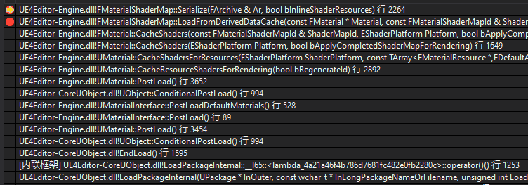

引擎启动时会通过反序列化，根据不同的FVertexFactoryType从Derived Data Cache中加载ShaderMap，存放在FMaterialShaderMap类型的FMaterial::MeshShaderMaps中，FVertexFactoryType可以参考[UE4_FSplineMeshVertexFactory](UE4_FSplineMeshVertexFactory.md)（各种VertexFactory对应的FVertexFactoryType的构造在加载ShaderMap之前）



```cpp
/** The material's cached shaders for vertex factory type dependent shaders. */
TIndirectArray<FMeshMaterialShaderMap> MeshShaderMaps;
```

然后调用InitOrderedMeshShaderMaps，根据MeshShaderMaps更新OrderedMeshShaderMaps

```cpp
/** The material's mesh shader maps, indexed by VFType->GetId(), for fast lookup at runtime. */
TArray<FMeshMaterialShaderMap*> OrderedMeshShaderMaps;
```

```cpp
void FMaterialShaderMap::Serialize(FArchive& Ar, bool bInlineShaderResources)
{
    ...
    if (Ar.IsLoading())
	{
		MeshShaderMaps.Empty();

		for(TLinkedList<FVertexFactoryType*>::TIterator VertexFactoryTypeIt(FVertexFactoryType::GetTypeList());VertexFactoryTypeIt;VertexFactoryTypeIt.Next())
		{
			FVertexFactoryType* VertexFactoryType = *VertexFactoryTypeIt;
			check(VertexFactoryType);

			if (VertexFactoryType->IsUsedWithMaterials())
			{
				new(MeshShaderMaps) FMeshMaterialShaderMap(GetShaderPlatform(), VertexFactoryType);
			}
		}

		// Initialize OrderedMeshShaderMaps from the new contents of MeshShaderMaps.
		InitOrderedMeshShaderMaps();

		// Material shaders
		TShaderMap<FMaterialShaderType>::SerializeInline(Ar, bInlineShaderResources, false);

		// Mesh material shaders
		int32 NumMeshShaderMaps = 0;
		Ar << NumMeshShaderMaps;

		for (int32 VFIndex = 0; VFIndex < NumMeshShaderMaps; VFIndex++)
		{
			FVertexFactoryType* VFType = nullptr;

			Ar << VFType;

			// Not handling missing vertex factory types on cooked data
			// The cooker binary and running binary are assumed to be on the same code version
			check(VFType);
			FMeshMaterialShaderMap* MeshShaderMap = OrderedMeshShaderMaps[VFType->GetId()];
			check(MeshShaderMap);
			MeshShaderMap->SerializeInline(Ar, bInlineShaderResources, false);
		}
	}
    ...
}
```