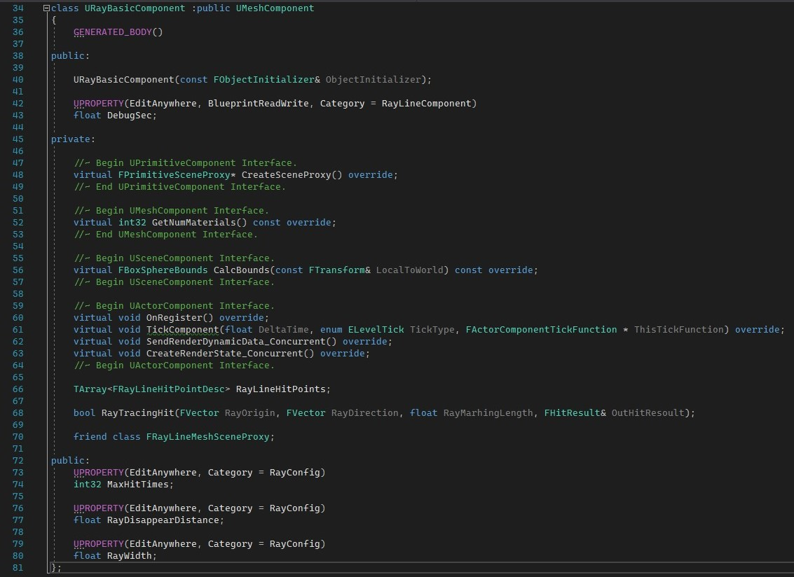
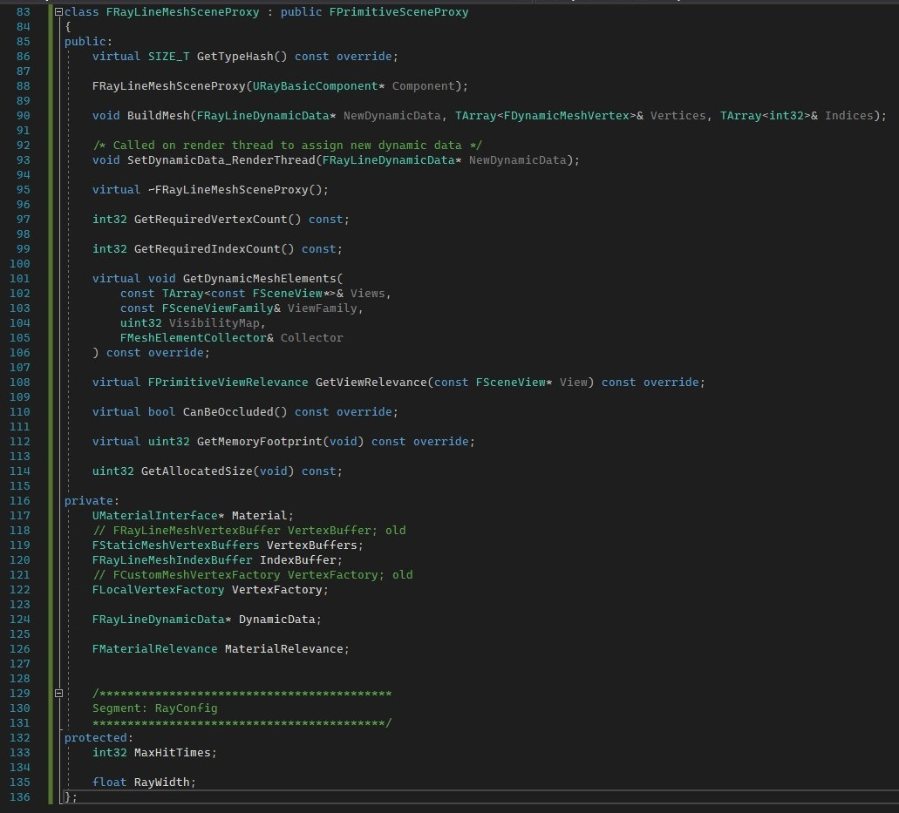

[UE官方文档](https://docs.unrealengine.com/zh-CN/Programming/Rendering/Overview/index.html)里有详细的介绍，但没有例子，不容易理解，这里简单记录下各个类型之间是如何交互和使用的。

## UPrimitiveComponent与FPrimitiveSceneProxy / FPrimitiveSceneInfo

UPrimitiveComponent为游戏线程，FPrimitiveSceneProxy / FPrimitiveSceneInfo为渲染线程。这里以一个custom的component为例。

### URayBasicComponent

### FRayLineMeshSceneProxy

CreateRenderState_Concurrent函数是在UWorld加载时被调用，主要用于将该Component添加到FScene的DrawList中，见[UE4_AddPrimitive](UE4_AddPrimitive.md)。

然后每一帧会调用SendRenderDynamicData_Concurrent，向FPrimitiveSceneProxy传递属性，在FPrimitiveSceneProxy::SetDynamicData_RenderThread更新FPrimitiveSceneProxy中VertexBuffer、IndexBuffer等渲染数据，绘制时，通过FPrimitiveSceneProxy::GetDynamicMeshElements获取这些数据

URayBasicComponent实现的是一个光束反射的功能，每个tick都会计算光束的碰撞点，调用SendRenderDynamicData_Concurrent将碰撞点的位置传入FRayLineMeshSceneProxy，在FRayLineMeshSceneProxy中根据传入的碰撞点信息，构建光束mesh的顶点和索引数据。这里没有用到CreateRenderState_Concurrent

绘制过程中通过调用FRayLineMeshSceneProxy::GetDynamicMeshElements将数据传入FMeshElementCollector中，见[UE4_Render](UE4_Render.md)中InitViews阶段。

### FPrimitiveSceneInfo
PrimitiveComponent被添加到Scene中时，会被封装为FPrimitiveSceneInfo，见[UE4_AddPrimitive](UE4_AddPrimitive.md)。

## 绘制规则
官方文档说的很清楚了，简单例子见[UE4_DrawingPolicy](UE4_DrawingPolicy.md)

> 绘制规则包括通过通道特定的着色器渲染网格体的逻辑。它们使用 FVertexFactory 接口来抽取网格体类型，并使用 FMaterial 接口来抽取材质详情。在最底层，一条绘制规则会负责一组网格体材质着色器以及一个顶点工厂，将顶点工厂的缓冲区与渲染硬件接口 (RHI) 绑定，将网格体材质着色器与 RHI 绑定，设置适当的着色器参数，然后执行 RHI 绘制调用。

